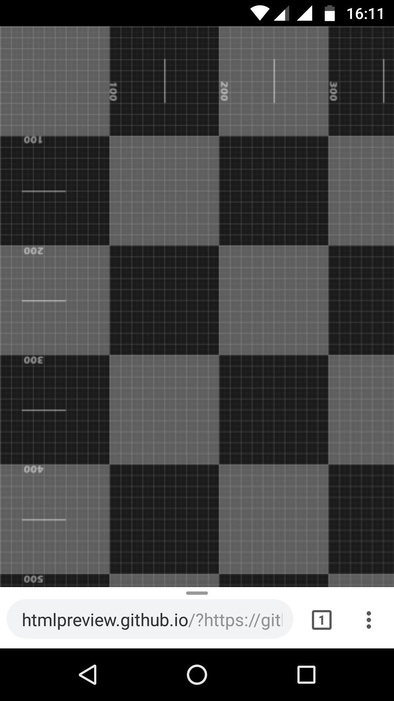
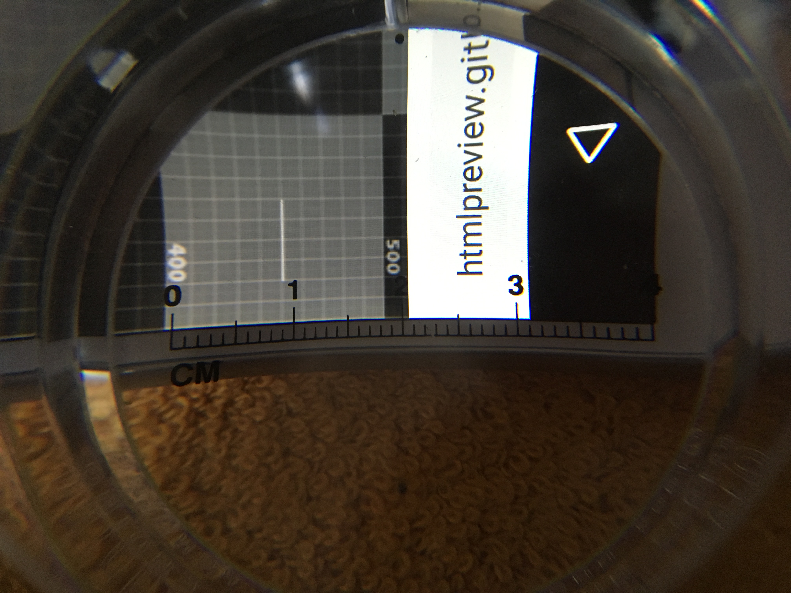
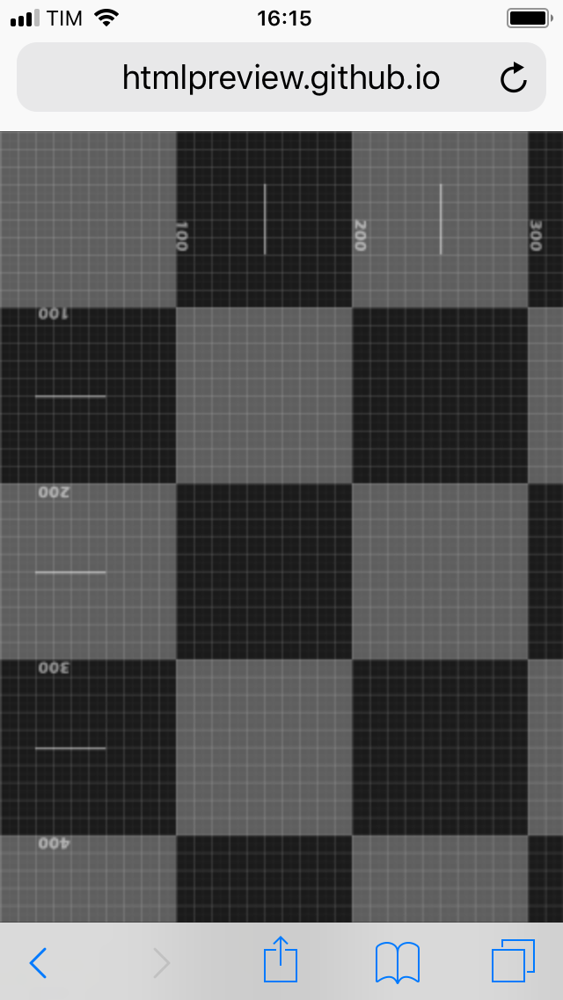
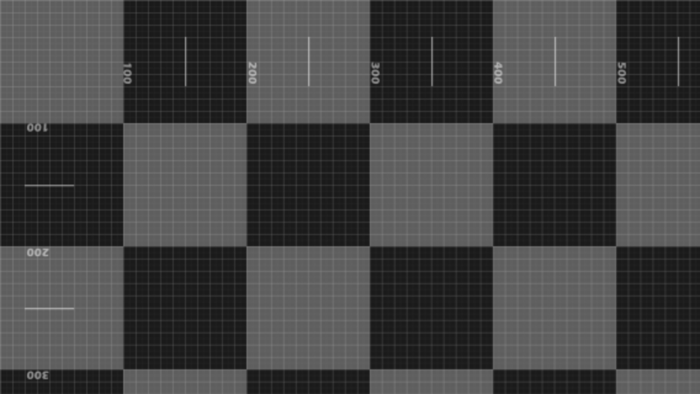

# testPixel

Use this page to calculate the Device Pixel Ratio (DPR) of your device.

Since I was unable to find the DPR for some of my devices I have created this web page, that according to the following code: 
<meta name="viewport" content="width=device-width, user-scalable=no, initial-scale=1.0, minimum-scale=1.0, maximum-scale=1.0"> 
will be loaded on your device using its DIP rather than a virtual viewport.

How to use?
Open the this <a href="http://htmlpreview.github.io/?https://github.com/CristianoZitarosa/testPixel/blob/master/index.html" target="_blank">link</a> on your device.

Then just count on the scale how many pixels are shown on the screen for each side.
Please note, in portrait mode probably your device's browser will take some space on top and bottom od the page, so rotate the device to landscape to have a clear vision of the scale in the sides (top and bottom in portrait become device's sides in landscape).

Search online your device's specs and divide each size for the relative size measured on the scale.
For example, my device's sizes are 1080x1920. I measure on the scale 360x640. 
For each side, my device has a DPR of 3. (1080/360=3  1920/640=3)
 
As you can see at the top and bottom the browser covers the screen, unfortunately rotating the device in landscape did not help because the navigation menu bar is not removed as happens in other apps so I used a scaled magnifier to calculate the covered area (directly in portrait). 

Another example with the iPhone SE: 
 
(I put a screenshot for both portrait and landscape but for this device in landscape the browser does not cover any area)
 
As you can see on the scale it is measured 320x570. Its sizes are 640x1136 the DPR is 2 for each side.

Values are confirmed on <a href="https://developer.apple.com/library/content/documentation/DeviceInformation/Reference/iOSDeviceCompatibility/Displays/Displays.html#//apple_ref/doc/uid/TP40013599-CH108-SW1" target="_blank">this page</a>. 
Reading on the scale I can't see it but according to the page from Apple honestly it should be 568px rather 570px.

thank you for reading
